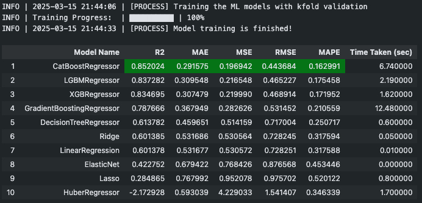

  [](https://codecov.io/gh/ozguraslank/flexml)
# FlexML

<div align="center">

</div>

## Introduction

**Warning:** README and notebooks files are designed for 1.1.0 pre-release version, If you want to use the most stable version, please go one commit before to access 1.0.3 documentations

FlexML is an easy-to-use and flexible AutoML library for Python that simplifies the process of building machine learning models. It automates model selection and hyperparameter tuning, offering users the flexibility to customize the size of their experiments by allowing to train all available models in the library or only a subset of them for faster results, FlexML adapts to your needs! <br> <br>
At the moment, FlexML supports only regression and classification tasks and offers two experiment modes; 'quick' and 'wide' allowing users to choose between fitting the most used machine learning models in the field or the full range of models available in the library.

## How to Install
To install FlexML 1.1.0 pre-release, you can use pip:

```bash
pip install flexml==1.1.0rc2
```

## Start Guide with Regression Experiment

```python
# Experiment for a Regression problem on California House Value Prediction dataset in Quick mode

from flexml import Regression
from sklearn.datasets import fetch_california_housing

df = fetch_california_housing(as_frame=True)['frame']

reg_exp = Regression(df, target_col="MedHouseVal")
reg_exp.start_experiment()
```
--> Once **start_experiment()** process finishes, you will see the model leaderboard as below: <br>
<div align="left">

</div>

```python
# Get the best model
best_model = reg_exp.get_best_models()

# Get the best model by name (Alternative)
best_model = reg_exp.get_model_by_name("CatBoostRegressor")

# Tune model (default model is the best model and randomized search for tuning)
reg_exp.tune_model()
```

--> Once **tune_model()** process finishes, you will see the updated model leaderboard as below: <br>
<div align="left">

</div>

<br>
You can also take a look to jupyter notebook files in the <b>'notebooks'</b> folder in the repository for more detailed explanations of the usage

## How to Contribute:

1. **Fork the repository:** Click on the 'Fork' button at the top right corner of the GitHub repository page
2. **Create a new branch:** Name your branch descriptively based on the feature or fix you're working on
3. **Make your changes:** Write code and tests to add your feature or fix the issue
   - You can take a look to **tests** folder in the repository to reach the current unittests
4. **Run tests:** Ensure all existing and new tests pass
5. **Submit a pull request:** Open a pull request with a clear description of your changes